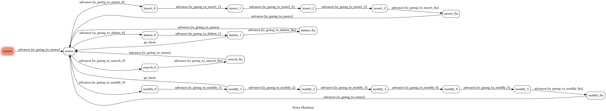

# TOC Project 2022
一個簡易的紀帳Line bot

A Line bot based on a finite state machine

### Prerequisite
* Python 3.9
* Pipenv
* Line App
* ngrok

## Line Bot執行方式
執行Line Bot服務
```sh
cd /path/to/project/directory
pipenv run python app.py
```

開啟另一個終端機

架設ngrok供外網連接
```sh
ngrok http 8000
```
該命令執行後，會產生一個網址

將該網址複製到Line bot project的webhook url裡

並在網址後接`/webhook`，line bot即可運作

## Line Bot使用方式
### 主選單
將Line Bot加為好友後，隨意發送一個留言即可進入主選單狀態
```sh
主選單命令:
新增
刪除
修改
查詢
```
輸入以上其中一個命令，即可執行對應的功能

### 新增
輸入`新增`後，Line bot會請求使用者輸入交易紀錄的日期、種類、名稱和金額

使用者必須根據Line bot提示的格式輸入訊息

輸入完畢後，Line bot會回覆`新增成功`，並回到主選單

### 刪除
輸入`刪除`後，Line bot會請求使用者輸入欲刪除紀錄之日期

接著，Line bot會列出該日所有交易紀錄，並請求使用者選擇刪除其中一筆紀錄

選擇完畢後，Line bot會回覆`刪除成功`，並回到主選單

若該日無任何紀錄，則Line bot會回覆`該日無任何紀錄`，並直接回到主選單

### 修改
輸入`修改`後，Line bot會請求使用者輸入欲修改紀錄之日期

接著，Line bot會列出該日所有交易紀錄，並請求使用者選擇修改其中一筆紀錄

選擇完畢後，Line bot會請求使用者輸入欲修改紀錄的日期、種類、名稱和金額

修改完畢後，Line bot會回覆`修改成功`，並回到主選單

若該日無任何紀錄，則Line bot會回覆`該日無任何紀錄`，並直接回到主選單

### 查詢
輸入`查詢`後，Line bot會請求使用者輸入欲查詢紀錄之日期

接著，Line bot會列出該日所有交易紀錄，並回到主選單

### 其他
使用者傳送的訊息可能不符合Line bot的期待

例如：不正確的日期格式、無法辨別的紀錄種類、過長的紀錄名稱、金額不是正整數、選擇一個不在列表範圍內的紀錄

此時Line bot會回覆`此內容無效，請輸入正確的資訊`，提醒使用者再次輸入

## Finite State Machine


## 其他
該Line bot的四項功能皆對同一個database的table做操作，而且會避免使用者們互相存取或修改其他人的紀錄。
